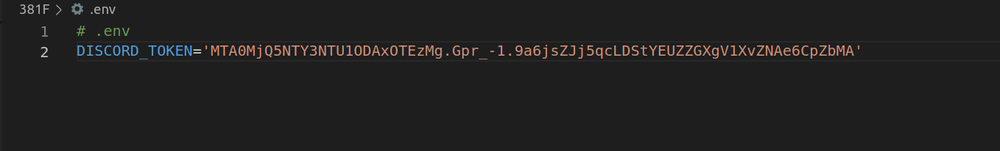
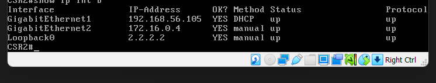
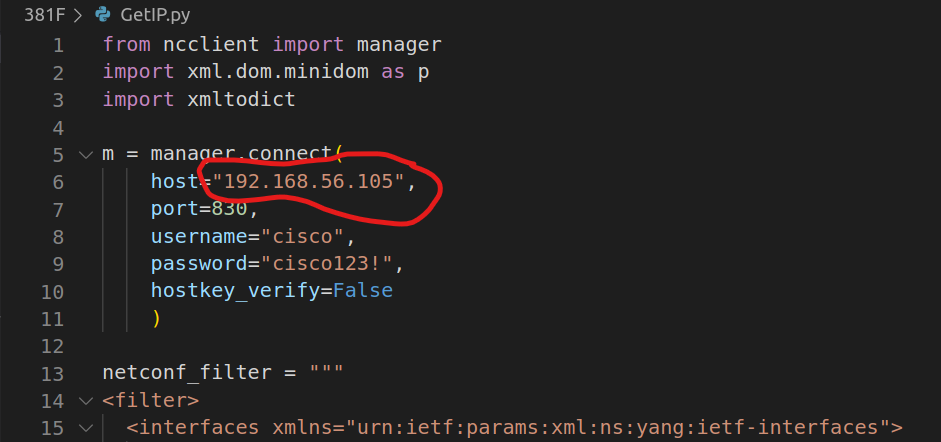
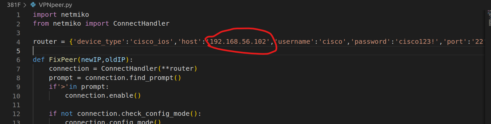
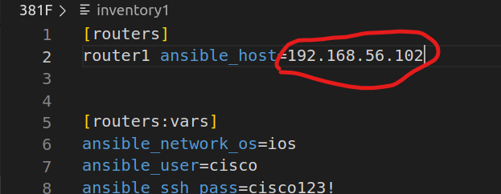
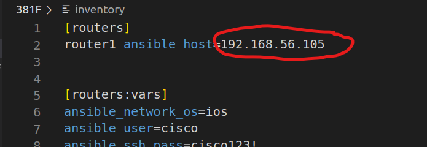
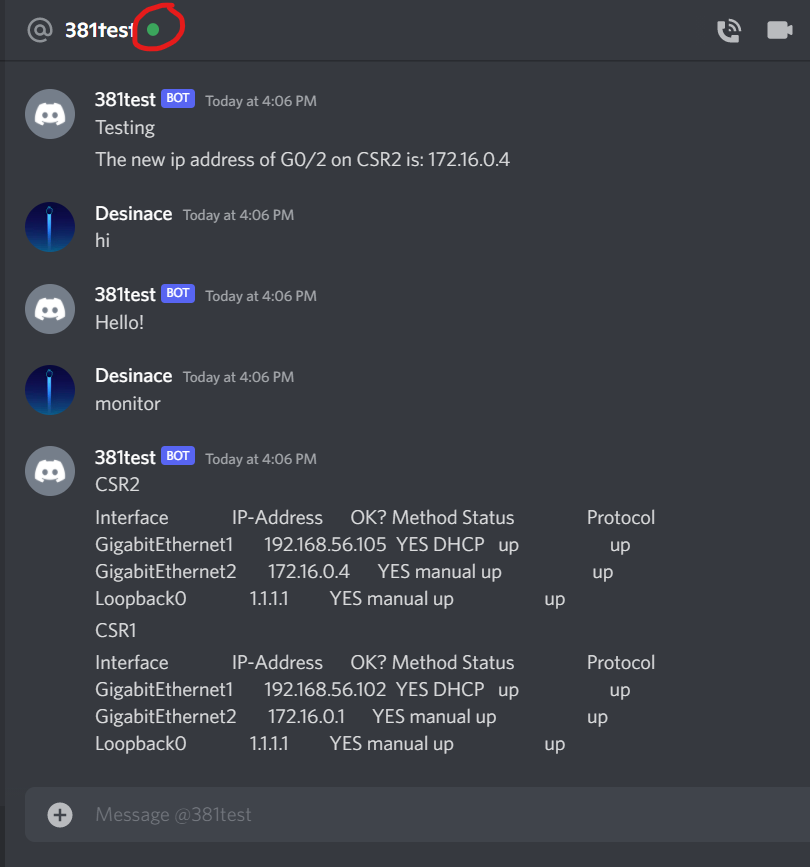

# 381FinalBot
Final project for 381 by Caleb, Joseph and Nathan.

*This tutorial is made with the assumption that the lab and routers are already configured

1. Create Discord Bot
  - go to [[https://discord.com/developers/applications](https://realpython.com/how-to-make-a-discord-bot-python/)] and follow the instructions to make a discord bot.
  - You do not need to worry about Bot permissions
  - Make sure that you copy the bot token when you create it

 2. Install the following packages
```
pip install -U discord.py==1.7.3
```
```
pip install -U python-dotenv
```
```
sudo pip install schedule
```

3. Add files to lab 
  - download the 381F file to your virtual lab
  - create a file in the folder called .env
  - enter DISCORD_TOKEN='copied tolken' into the .env file(See image below)



4. Change IP addresses

  -Get the IP addresses from both your routers
  
  

  -You may need to change the IP address in the GetIP.py file under host: to the correct interface IP of CSR2 (See image below)
  


  -You may need to change the host IP in the VNPpeer.py to the correct interface of CSR1 in the host section (see image below)
  


  -You may need to change the ip address in the inventory1 file to the correct interface IP of CSR1 (see image below)
  


  -finally, you may need to change the ip address in the inventory file to the correct interface IP of CSR2 (see image below)
  
 

6. Run bot  
  -In your lab enter the command:
  ```
  python3 381bot.py
  ```
  - You should see the message in you termial that the bot has logged in the bot icon should be green in discord
  - the bot will resond to you typing 'hi', or you can type 'start' the have the ip test fucntion run continously, or you can type 'test for it to run once



